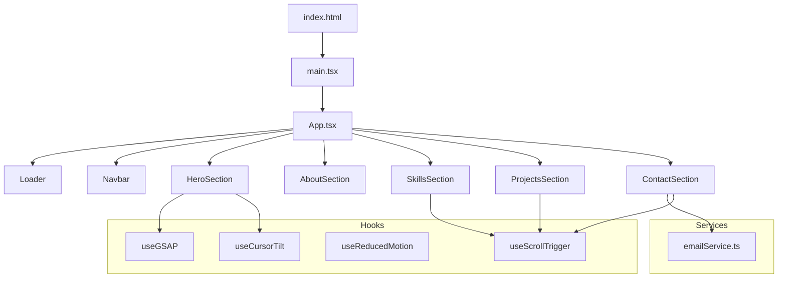

# Design Document: 3D Portfolio Website

## Overview

A single-page application (SPA) built with React + Vite (TypeScript) that presents a Software Engineering Diploma student's portfolio through GSAP-driven 3D animations and scroll-triggered interactions. The site targets internship recruiters and must deliver a polished, performant experience across all device sizes.

Key technology choices:
- **React 18 + Vite** — fast dev/build toolchain with TypeScript support
- **GSAP + ScrollTrigger** — industry-standard animation library; handles all transitions, 3D effects, and scroll-driven sequences
- **EmailJS** — client-side email delivery for the contact form (no backend required)
- **CSS Modules / Tailwind** — scoped styling with responsive utilities

The site is entirely static; no server-side rendering or database is needed.

---

## Architecture



### Data flow

1. `App.tsx` mounts `Loader` first; all other sections are hidden.
2. When `Loader` fires `onComplete`, GSAP reveals `HeroSection` and registers global `ScrollTrigger` instances.
3. Each section component owns its own GSAP context (via `useGSAP`) so animations are properly cleaned up on unmount.
4. `ContactSection` calls `emailService.ts` on form submit; result updates local React state (success / error).

---

## Components and Interfaces

### App.tsx

```ts
interface AppState {
  loaderDone: boolean;
}
```

Renders all sections in DOM order. Passes `onComplete: () => void` to `Loader`.

---

### Loader

```ts
interface LoaderProps {
  onComplete: () => void;
}
```

- Full-screen overlay with GSAP progress animation.
- Listens to `window` `load` event; if load exceeds 3 s, shows a visible progress indicator.
- On completion, plays exit timeline then calls `onComplete`.

---

### Navbar

```ts
interface NavLink {
  label: string;
  targetId: string; // matches section element id
}

interface NavbarProps {
  links: NavLink[];
}
```

- Fixed position; uses GSAP `scrollTo` for smooth navigation.
- `ScrollTrigger` instances per section set an `active` class on the matching link.
- Below 768 px: hamburger icon toggles a GSAP slide-in drawer.

---

### HeroSection

No external props. Internal state:

```ts
interface HeroState {
  tiltX: number; // degrees, clamped to [-maxTilt, maxTilt]
  tiltY: number;
}
```

- Staggered text reveal on mount.
- 3D background element driven by GSAP.
- `mousemove` → `gsap.quickTo` for smooth parallax tilt.
- CTA button scrolls to `#projects`.
- ScrollTrigger exit: fade + scale out.

---

### AboutSection

No external props. Static content (name, program, institution, graduation year, CV link).

---

### SkillBadge

```ts
interface SkillBadgeProps {
  name: string;
  category: 'Languages' | 'Frameworks' | 'Tools';
  proficiency: number; // 0–1
  iconUrl?: string;
}
```

- Animated proficiency bar/ring via GSAP on scroll into view.
- GSAP 3D flip/scale on hover.

---

### SkillsSection

```ts
interface SkillsData {
  languages: SkillBadgeProps[];
  frameworks: SkillBadgeProps[];
  tools: SkillBadgeProps[];
}
```

- Groups badges by category.
- ScrollTrigger staggered pop-in entrance.

---

### ProjectCard

```ts
interface ProjectCardProps {
  title: string;
  description: string;
  tags: string[];
  repoUrl: string;
  demoUrl?: string;
  imageUrl?: string;
}
```

- GSAP cursor-tracking 3D tilt on hover (rotation clamped to ±15°).
- GSAP overlay reveal on hover (description + links).

---

### ProjectsSection

```ts
interface ProjectsSectionProps {
  projects: ProjectCardProps[]; // minimum 3
}
```

- ScrollTrigger staggered 3D rotation entrance per card.

---

### ContactForm

```ts
interface ContactFormState {
  name: string;
  email: string;
  message: string;
  errors: Partial<Record<'name' | 'email' | 'message', string>>;
  status: 'idle' | 'sending' | 'success' | 'error';
}
```

- Client-side validation before submit.
- Calls `emailService.send()`; handles success and network error states.
- Preserves input on error.

---

### ContactSection

Wraps `ContactForm` and displays email + LinkedIn URL. ScrollTrigger fade-up entrance.

---

### emailService.ts

```ts
interface EmailPayload {
  fromName: string;
  fromEmail: string;
  message: string;
}

function send(payload: EmailPayload): Promise<void>;
```

Thin wrapper around EmailJS SDK.

---

## Data Models

### Skill

```ts
interface Skill {
  id: string;
  name: string;
  category: 'Languages' | 'Frameworks' | 'Tools';
  proficiency: number; // 0.0 – 1.0 inclusive
  iconUrl?: string;
}
```

### Project

```ts
interface Project {
  id: string;
  title: string;
  description: string;
  tags: string[];          // technology names
  repoUrl: string;         // required
  demoUrl?: string;        // optional
  imageUrl?: string;       // optional thumbnail
}
```

### ContactMessage

```ts
interface ContactMessage {
  fromName: string;        // non-empty
  fromEmail: string;       // valid email format
  message: string;         // non-empty
}
```

### AnimationConfig

```ts
interface AnimationConfig {
  reducedMotion: boolean;  // derived from prefers-reduced-motion
  maxTiltDeg: number;      // default 15
  staggerDelay: number;    // seconds between staggered items
}
```

All content data (skills, projects, personal info) lives in `src/data/` as typed TypeScript constants — no runtime API calls needed.

---

## Correctness Properties

*A property is a characteristic or behavior that should hold true across all valid executions of a system — essentially, a formal statement about what the system should do. Properties serve as the bridge between human-readable specifications and machine-verifiable correctness guarantees.*

### Property 1: Hero tilt values are always clamped

*For any* cursor position within or outside the Hero section bounds, the computed parallax tilt values (tiltX, tiltY) must always fall within the range [-maxTilt, maxTilt] degrees.

**Validates: Requirements 2.3**

---

### Property 2: Active Navbar link matches scrolled section

*For any* section on the page, when that section is scrolled into the viewport, exactly one Navbar link — the one corresponding to that section — must have the active class applied, and all other links must not.

**Validates: Requirements 3.4**

---

### Property 3: Skills badge count equals skill data count

*For any* skills dataset, the number of rendered Skill_Badge elements must equal the total number of skills in the dataset (across all categories).

**Validates: Requirements 5.1**

---

### Property 4: Skills badges are grouped by category

*For any* skills dataset, every Skill_Badge rendered within a category group must have a category value that matches that group's category label.

**Validates: Requirements 5.4**

---

### Property 5: Proficiency indicator is always within valid bounds

*For any* proficiency value in the range [0, 1], the rendered proficiency bar or ring width/fill percentage must be between 0% and 100% inclusive.

**Validates: Requirements 5.5**

---

### Property 6: Project card tilt is always clamped

*For any* cursor offset relative to a Project_Card, the computed 3D tilt rotation values must always fall within [-15°, 15°].

**Validates: Requirements 6.3**

---

### Property 7: Project card always renders required fields

*For any* project data object, the rendered Project_Card must contain the project title, all technology tags, the description text, and a link to the source code repository.

**Validates: Requirements 6.5**

---

### Property 8: Demo link is shown if and only if demoUrl is present

*For any* project data object, a live demo link is rendered in the Project_Card if and only if the project's `demoUrl` field is non-empty.

**Validates: Requirements 6.6**

---

### Property 9: Contact form shows an error for every empty required field

*For any* combination of empty required fields (name, email, message) on form submission, each empty field must have a corresponding inline validation error displayed, and the page must not reload.

**Validates: Requirements 7.5**

---

### Property 10: Layout renders without overflow at any supported viewport width

*For any* viewport width between 320 px and 2560 px, no section of the Portfolio_Site should produce horizontal overflow or broken layout.

**Validates: Requirements 8.1**

---

### Property 11: Reduced-motion disables all GSAP animations

*For any* component that registers a GSAP animation, when the `prefers-reduced-motion` media query is active, the animation duration must be 0 or the animation must be skipped entirely.

**Validates: Requirements 9.4**

---

## Error Handling

### Asset loading failures
- Images that fail to load fall back to a CSS placeholder (background colour + initials or icon).
- If the GSAP library itself fails to load (CDN outage), the site degrades gracefully: sections are visible without animation, no JS errors block content.

### Contact form errors
- **Validation errors** (empty fields, invalid email format): displayed inline next to each field; form is not submitted.
- **Network / EmailJS errors**: a descriptive banner error is shown above the form; all field values are preserved in state so the user does not lose their message
.
- **Retry**: the form submit button is re-enabled after an error so the user can retry without refreshing.

### Reduced-motion / accessibility
- If `prefers-reduced-motion` is detected, all GSAP timelines are either skipped or set to duration 0. Content is always visible regardless of animation state.

### Performance degradation
- On mobile viewports (< 768 px), 3D perspective transforms are simplified (fewer particles, no cursor-tracking tilt) to avoid frame drops.
- `will-change: transform` is applied only to actively animating elements and removed after animation completes to avoid excessive GPU memory usage.

---

## Testing Strategy

### Dual testing approach

Both unit tests and property-based tests are required. They are complementary:
- **Unit tests** catch concrete bugs in specific scenarios and edge cases.
- **Property-based tests** verify universal correctness across a wide range of generated inputs.

### Unit tests

Focus areas:
- `Loader`: `onComplete` fires after GSAP timeline; progress indicator appears after 3 s mock delay.
- `Navbar`: all five links render; active class logic; hamburger toggle at < 768 px.
- `ContactForm`: inline errors for each empty field combination; success state; error state with input preservation.
- `AboutSection`: all required content fields render; CV link has correct `href` and `download` attribute.
- `ProjectCard`: required fields present; demo link conditional rendering.
- `App`: all sections mount without errors; Loader → Hero transition fires `onComplete`.

Use **Vitest** + **React Testing Library** for all unit and integration tests.

### Property-based tests

Use **fast-check** (TypeScript-native PBT library) with a minimum of **100 iterations per property**.

Each property test must include a comment referencing the design property it validates:

```
// Feature: 3d-portfolio-website, Property N: <property_text>
```

| Property | Test description | fast-check arbitraries |
|---|---|---|
| P1: Hero tilt clamped | Generate random (x, y) cursor coords; assert tiltX, tiltY ∈ [-maxTilt, maxTilt] | `fc.float()` pairs |
| P2: Active Navbar link | Generate random section index; assert only that link is active | `fc.integer({min:0, max:4})` |
| P3: Badge count equals skill count | Generate random skills array; assert rendered badge count equals input length | `fc.array(fc.record({...}))` |
| P4: Badges grouped by category | Generate random skills; assert each badge is in the correct category group | `fc.array(fc.record({...}))` |
| P5: Proficiency bounds | Generate random proficiency in [0,1]; assert rendered width ∈ [0%, 100%] | `fc.float({min:0, max:1})` |
| P6: Card tilt clamped | Generate random cursor offsets; assert rotation ∈ [-15°, 15°] | `fc.float()` pairs |
| P7: Card required fields | Generate random Project objects; assert all required fields present in render | `fc.record({...})` |
| P8: Demo link iff demoUrl | Generate projects with/without demoUrl; assert link presence matches | `fc.option(fc.webUrl())` |
| P9: Form validation errors | Generate all non-empty subsets of {name, email, message} as empty; assert each gets an error | `fc.subarray(['name','email','message'])` |
| P10: No overflow at any width | Generate widths in [320, 2560]; assert no horizontal overflow | `fc.integer({min:320, max:2560})` |
| P11: Reduced-motion disables animations | Mock `prefers-reduced-motion`; assert all GSAP durations are 0 | `fc.constant(true)` |

### Edge cases (unit tests)
- Loader with exactly 3 s load time (boundary of progress indicator trigger).
- `proficiency = 0` and `proficiency = 1` (boundary values for bar).
- Project with no `demoUrl` (undefined vs empty string).
- Contact form submitted with all fields empty simultaneously.
- Viewport width exactly 768 px (breakpoint boundary).
- Skills dataset with zero items per category.
